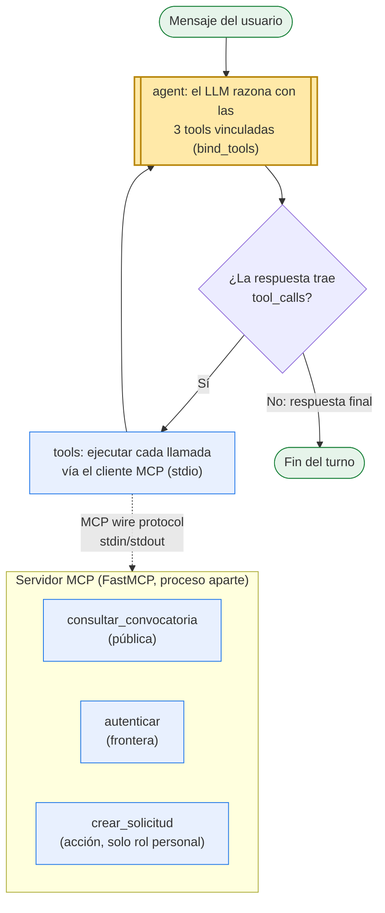
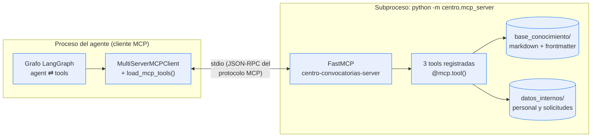

# Entrega Semana 2 — Tool calling y arquitectura MCP

**Caso:** Asistente de Evaluación de Convocatorias y Conformación de Equipos — Universidad de los Alpes
**Principio de diseño de esta entrega:** entre más simple, mejor. La rúbrica pide *al menos tres* herramientas; implementamos exactamente tres, con el patrón de los tutoriales del curso.

---

## 1. Reflexión y diagrama actualizado

### Diagrama coherente con la implementación



El grafo es el ciclo ReAct del tutorial del curso: `agent ⇄ tools` con una arista condicional. El agente es **stateful**: `AgentState` acumula el historial completo con el reducer `add_messages`, así el token que devuelve `autenticar` en un turno está disponible cuando el modelo decide invocar `crear_solicitud` en el siguiente.

### Hipótesis revisadas y cambios realizados

La primera versión de esta entrega tenía **diez herramientas** y tres módulos de soporte (~900 líneas). Al revisarla contra la rúbrica —que pide *al menos tres* tools— y contra el principio de agencia mínima del curso, la simplificamos a **tres herramientas en un solo módulo (~350 líneas)**:

- **Hipótesis original:** cada operación del caso (buscar, leer, consultar política, autenticar, ver perfil, listar personal, listar solicitudes, crear, asignar, escalar) merecía su propia tool desde ya.
- **Qué aprendimos:** cada tool adicional agranda el esquema que el modelo recibe en cada invocación, aumenta la probabilidad de una llamada equivocada y amplía la superficie de ataque. Para demostrar tool calling y MCP bastan las tres capacidades esenciales del caso; el resto (asignación del directivo, escalamiento como tool) llega en las próximas semanas, cuando la entrega lo exija.
- **Fusiones concretas:** `buscar_convocatorias` + `leer_convocatoria` → `consultar_convocatoria` (una sola pregunta: "¿qué dice esta convocatoria?"); `autenticar` + `consultar_perfil` → `autenticar` devuelve el perfil propio (el modelo ya no necesita una segunda llamada); las políticas ya no se leen como tool aparte — los topes (overhead, sectores restringidos) se validan **dentro** de `crear_solicitud`, que es donde importan.

### Evolución de la decisión agéntica

En la semana 1 la decisión agéntica era un rombo dibujado: un nodo router que clasificaba la intención. En la implementación real la decisión **no es un nodo con reglas**: emerge del propio LLM con las tools vinculadas. El modelo lee el mensaje y decide si invoca `consultar_convocatoria` de inmediato (consulta pública), si primero pide credenciales y llama `autenticar` (gestión personal), o si responde sin tools. La arista condicional `should_continue` solo observa si la respuesta trae `tool_calls` — no contiene lógica de negocio.

Lo determinista se movió a donde debe vivir: **dentro de las herramientas**. El control de rol, las brechas de política y el rechazo de duplicados se validan en `crear_solicitud`, no en el prompt. El modelo propone; el harness controla.

---

## 2. Diseño de herramientas

### Tabla de tools

| # | Tool | Descripción | Parámetros | Retorno |
|---|------|-------------|------------|---------|
| 1 | `consultar_convocatoria` | Encuentra una convocatoria abierta (por id o texto libre) y devuelve sus bases completas, sus condiciones y las señales de riesgo detectables. Información pública, sin autenticación. | `consulta: str` | `str` (JSON): bases + `overhead_maximo_pct`, `overhead_minimo_institucional_pct`, `señales_de_riesgo`, `texto`; o `ok=false` con `ids_disponibles` |
| 2 | `autenticar` | Valida cédula y clave, abre una sesión con rol y devuelve el perfil propio (nunca el de otro, nunca la clave). | `cedula: str`, `clave: str` | `str` (JSON): `token`, `rol`, `perfil`; o `ok=false` con error genérico |
| 3 | `crear_solicitud` | Registra la postulación del usuario autenticado tras validar rol y brechas (riesgo reputacional, overhead, duplicado). Exclusiva del rol `personal`. | `token: str`, `convocatoria_id: str`, `rol_propuesto: str`, `justificacion: str` | `str` (JSON): `accion: "solicitud_creada"` + solicitud; o `ok=false` con `brecha` específica |

### Justificación de su necesidad

Cada tool corresponde a una capacidad que el caso exige y que el modelo no puede cumplir solo: no puede *saber* qué dice una convocatoria (tool 1: la lee de la base de conocimiento), no puede *verificar* una identidad (tool 2: valida credenciales contra el registro), y no puede *registrar* una postulación (tool 3: escribe en el sistema interno). Son además los tres tipos de tool del caso: lectura pública, frontera de autenticación y acción con efectos.

### Decisiones de diseño

1. **Granularidad fina, como en el tutorial.** Cada tool hace exactamente una cosa y todos sus parámetros son siempre relevantes — no hay campos condicionales que el modelo deba "decidir ignorar" (el antipatrón `convert_or_calculate` del tutorial de MCP).
2. **Errores como información, no como excepciones.** Todas devuelven JSON con el contrato `{"ok": true|false}`. Un `ok=false` trae la brecha concreta (`overhead`, `riesgo_reputacional`, `duplicada`) y datos útiles (los porcentajes en conflicto, los ids disponibles), para que el agente explique el problema en lugar de rechazar genéricamente.
3. **La autorización vive en la tool, no en el prompt.** `crear_solicitud` valida token y rol del lado del servidor: si el modelo fuera persuadido de crear una solicitud con una sesión de directivo o un token inventado, la herramienta la rechaza igual. El prompt orienta; la infraestructura restringe.
4. **Tres y no diez.** Cada tool extra es esquema adicional en cada invocación del modelo y superficie de ataque adicional (principio de agencia mínima). Las capacidades del directivo llegarán cuando una entrega las exija.

---

## 3. Evidencia del agente con tool calling

El agente es stateful (`AgentState` con `add_messages`) y los flujos corren de extremo a extremo contra el servidor MCP real por stdio. Para que la evidencia sea **reproducible sin GPU ni Ollama**, la decisión del modelo está guionizada (`ScriptedLLM`); todo lo demás —el servidor, el descubrimiento de tools, la autenticación, las validaciones y el estado— es real. Reproducir: `python -m centro.evidencia_flujo`.

### Flujo 1 — consulta pública: se responde sin pedir identidad

```text
[HANDSHAKE MCP] 3 herramientas descubiertas:
  consultar_convocatoria, autenticar, crear_solicitud

[ENTRADA DEL USUARIO]
¿Qué pide la convocatoria del BID de innovación en educación superior?

[DECISIÓN DEL AGENTE] -> invocar herramienta
  herramienta: consultar_convocatoria
  argumentos : {"consulta": "BID-2026-EDU-014"}

[RESULTADO DEL SERVIDOR MCP]
  {
    "ok": true,
    "fuente": "publica",
    "id": "BID-2026-EDU-014",
    "titulo": "Innovación pedagógica y permanencia en educación superior",
    "entidad": "Banco Interamericano de Desarrollo (BID)",
    "tipo": "investigacion",
    "area": "educacion_superior",
    "cierre": "2026-09-30",
    "monto_cop": 1850000000,
    "overhead_maximo_pct": 12,
    "overhead_minimo_institucional_pct": 15,
    "señales_de_riesgo": [],
    "texto": "<1899 caracteres de texto markdown>"
  }

[RESPUESTA FINAL DEL AGENTE]
Las bases de la BID-2026-EDU-014 (fuente pública, sin necesidad de identificarte)
piden tener en cuenta dos condiciones antes de postularse:

1. CONSORCIO. Exige un consorcio con al menos una universidad de otro país miembro
   del BID; las propuestas de una sola institución no quedan habilitadas.
2. OVERHEAD. La convocatoria reconoce un máximo del 12% de costos indirectos y el
   mínimo institucional para organismos internacionales es 15% (POL-FIN-001): hay
   una brecha de 3 puntos que solo levanta una exención de la Vicerrectoría.

Cierra el 30 de septiembre de 2026. [...]
```

**Lectura:** el mensaje no toca datos de ningún miembro del Centro, así que el agente resolvió con la tool pública y **no invocó `autenticar`** — la distinción público/interno surgió del análisis de la intención, no de una regla por palabra clave.

### Flujo 2 — postulación: autenticar, contrastar el perfil y crear la solicitud

```text
[ENTRADA DEL USUARIO]
¿Puedo aplicar a la convocatoria de Minciencias de ciencias económicas y administrativas?

[DECISIÓN DEL AGENTE] -> invocar herramienta
  herramienta: autenticar
  argumentos : {"cedula": "1080901234", "clave": "3846"}

[RESULTADO DEL SERVIDOR MCP]
  { "ok": true, "fuente": "interna", "token": "ses_685e27983318549d",
    "rol": "personal",
    "perfil": { "nombre": "Ricardo Tovar", "publicaciones_ultimos_5_anios": 7,
                "dedicacion": "tiempo_completo", ... } }

[DECISIÓN DEL AGENTE] -> invocar herramienta
  herramienta: consultar_convocatoria
  argumentos : {"consulta": "MINCIENCIAS-2026-CEA-003"}

[RESULTADO DEL SERVIDOR MCP]
  { "ok": true, "fuente": "publica", "id": "MINCIENCIAS-2026-CEA-003",
    "cierre": "2026-11-14", "overhead_maximo_pct": 15,
    "overhead_minimo_institucional_pct": 12, ... }

[DECISIÓN DEL AGENTE] -> invocar herramienta
  herramienta: crear_solicitud
  argumentos : {"token": "ses_685e2798…", "convocatoria_id": "MINCIENCIAS-2026-CEA-003",
                "rol_propuesto": "investigador principal", "justificacion": "Acredita 7
                publicaciones en los últimos 5 años (la convocatoria exige 3) y dedicación
                de tiempo completo, requisito del investigador principal. [...]"}

[RESULTADO DEL SERVIDOR MCP]
  { "ok": true, "fuente": "interna", "accion": "solicitud_creada",
    "solicitud": { "id": "SOL-0005", "nombre": "Ricardo Tovar", "estado": "pendiente", ... },
    "nota": "La solicitud queda en estado pendiente. La asignación final del equipo
             es una decisión de la Dirección del Centro." }

[RESPUESTA FINAL DEL AGENTE]
Listo, Ricardo: tu solicitud quedó creada con el identificador SOL-0005 (confirmado
por la herramienta). [...] tú te postulas, la asignación final la decide la Dirección.
```

**Lectura:** tres invocaciones encadenadas donde cada una depende de la anterior — el token viaja del resultado de `autenticar` a los argumentos de `crear_solicitud`, y la confirmación de creación proviene de la herramienta, nunca del modelo.

### Flujo 3 — manejo explícito de un error: la brecha bloquea la acción

```text
[ENTRADA DEL USUARIO]
Créame la solicitud para la convocatoria del BID de educación superior.

[DECISIÓN DEL AGENTE] -> invocar herramienta
  herramienta: autenticar
  argumentos : {"cedula": "1030456789", "clave": "2964"}

[DECISIÓN DEL AGENTE] -> invocar herramienta
  herramienta: crear_solicitud
  argumentos : {"token": "ses_ff586968…", "convocatoria_id": "BID-2026-EDU-014", ...}

[RESULTADO DEL SERVIDOR MCP]
  {
    "ok": false,
    "error": "No puede crearse una solicitud: la convocatoria reconoce un overhead
              máximo del 12% y el mínimo institucional para ese tipo de entidad es
              15% (POL-FIN-001). Requiere exención de la Vicerrectoría, que tramita
              la Dirección.",
    "brecha": "overhead",
    "overhead_convocatoria_pct": 12,
    "overhead_minimo_institucional_pct": 15
  }

[RESPUESTA FINAL DEL AGENTE]
No pude crear la solicitud, Carolina, y la razón es concreta: la herramienta devolvió
ok=false con brecha de OVERHEAD. [...] No quedó registrada ninguna solicitud.
```

**Manejo de errores en tres capas**, todas verificadas por tests:

1. **Resultado inesperado de negocio:** la tool devuelve `ok=false` con la brecha específica y el agente la comunica sin crear nada (este flujo, y las brechas `riesgo_reputacional` y `duplicada` en los tests).
2. **Fallo de ejecución:** `tools_node` captura excepciones y llamadas a herramientas inexistentes, y las convierte en un `ToolMessage` de error legible para que el modelo reaccione (test `test_herramienta_desconocida_devuelve_error_controlado`).
3. **Ciclo sin progreso:** `should_continue` corta el grafo al superar `MAX_ITERACIONES`, el circuit breaker del harness.

---

## 4. Arquitectura MCP

### Implementación



- **Servidor** (`centro/mcp_server.py`): FastMCP en modo stdio, expone las tres herramientas delegando en `centro/tools.py` — la lógica no se duplica, así los tests ejercitan lo mismo que sirve el servidor.
- **Cliente** (`centro/graph.py`): `MultiServerMCPClient` lanza el servidor como subproceso, `load_mcp_tools()` **descubre las herramientas dinámicamente** (no hay ninguna tool declarada en el cliente) y `bind_tools()` se las entrega al modelo. La sesión permanece abierta durante todo el grafo para que las invocaciones compartan la misma conexión.

### Evidencia de ejecución

El handshake real de cada flujo (sección 3) muestra el descubrimiento dinámico:

```text
[HANDSHAKE MCP] 3 herramientas descubiertas:
  consultar_convocatoria, autenticar, crear_solicitud
```

Y la suite completa (17 tests, incluidos los flujos extremo a extremo por stdio) pasa:

```text
$ pytest -m semana2 -q
.................                                                        [100%]
17 passed
```

### ¿Qué cambia si el servidor MCP lo opera un equipo externo?

- **El código del cliente casi no cambia:** como las tools se descubren con `load_mcp_tools()`, bastaría reemplazar la configuración stdio por la URL del servidor remoto (transporte HTTP/SSE). Ninguna tool está cableada en el cliente.
- **Cambia la confianza.** Hoy servidor y cliente son del mismo equipo; con un tercero, los esquemas y descripciones de las tools se vuelven contenido no confiable que entra al contexto del modelo (riesgo de prompt injection vía descripciones), y habría que validar/fijar versiones del contrato.
- **Cambia la seguridad del canal:** stdio no necesita autenticación de red porque el subproceso es local; un servidor remoto exige TLS, autenticación del cliente (API key/OAuth) y autorización por herramienta.
- **Cambian los modos de falla:** aparecen latencia, indisponibilidad y rate limiting. El contrato `ok=false` ya prepara al agente para tratar fallos como información, y el tope de iteraciones evita reintentos infinitos, pero un despliegue real sumaría timeouts y reintentos con backoff en el cliente.
- **Cambia la evolución del contrato:** el tercero puede agregar, quitar o renombrar tools sin avisar. El descubrimiento dinámico lo tolera técnicamente; operacionalmente exigiría *pinning* de versión y monitoreo del manifiesto.

---

## 5. Verificación del repositorio

- `.github/workflows/entrega.yml` contiene únicamente el pipeline de la semana 2, que instala dependencias y ejecuta `pytest -m semana2`.
- Verificación local previa al push: `pytest -m semana2 -q` → **17 passed**.


> ⚠️ Reemplazar por la captura real de la pestaña Actions con el workflow en verde (debe verse el nombre del workflow, el commit y el check).
