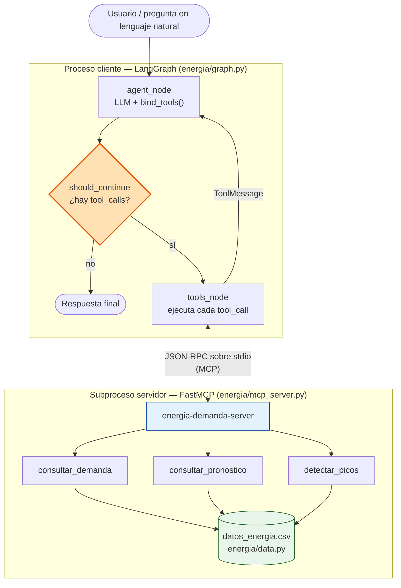
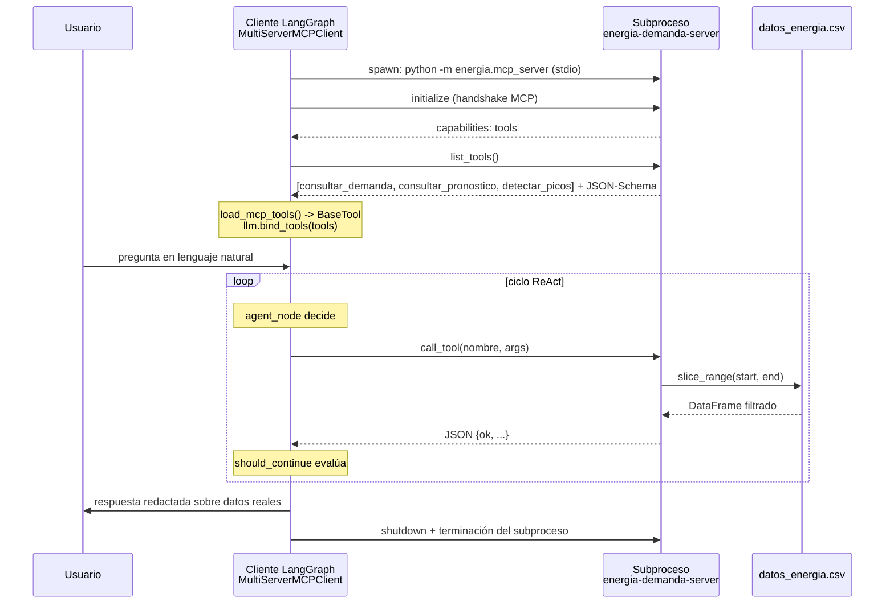

# Reflexión — Semana 2

**Proyecto:** Analista de demanda energética (Austria, ENTSO-E)
**Repositorio:** [mesabusta/agente-demanda-energetica](https://github.com/mesabusta/agente-demanda-energetica)
**Integrantes:** [mesabusta](https://github.com/mesabusta) · [ysusecheo93](https://github.com/ysusecheo93)

---

## 1. Reflexión y diagrama actualizado

### Diagrama actualizado (semana 2)



> **Diagrama de la semana 1:** [enlace pendiente — pegar aquí la imagen o el enlace a la herramienta de diagramación]

### 1.1 Cambios respecto al diagrama de la semana 1

**¿Qué hipótesis del diseño original resultó incorrecta o incompleta?**

La hipótesis que falló fue **suponer que el LLM podía razonar sobre los datos directamente**. En el diagrama de la semana 1 el modelo recibía el contexto del dataset y respondía; en la práctica eso produce cifras inventadas, porque un LLM no calcula un promedio sobre 10.000 filas horarias. El diseño era incompleto en dos puntos más:

- **No contemplaba el camino de error.** Asumimos que toda consulta era resoluble. El dataset solo cubre `2019-07-25` a `2020-10-06`, así que cualquier pregunta fuera de ese rango tenía que tener una ruta de recuperación explícita, no un fallo silencioso.
- **No separaba el proceso del agente del proceso de los datos.** Tratábamos el acceso al CSV como una función interna más, no como un servicio con su propio contrato.

**¿Qué nodos o conexiones agregaron al incorporar tool calling y MCP?**

| Elemento nuevo | Rol |
|---|---|
| `tools_node` | Nodo ejecutor: recorre `last.tool_calls`, despacha contra `tools_map` y devuelve un `ToolMessage` por llamada. |
| Arista `tools_node → agent_node` | Cierra el ciclo ReAct: el resultado vuelve al LLM como contexto en lugar de terminar el grafo. |
| Arista condicional `should_continue` | Bifurcación entre `tools` y `END` según exista o no `tool_calls` en el último mensaje. |
| Frontera de proceso MCP | El servidor ya no es una función importada: es un **subproceso separado** que habla JSON-RPC sobre stdio. |
| Handshake `list_tools()` | Nodo previo al ciclo: el cliente descubre las tools en tiempo de ejecución en vez de tenerlas cableadas. |

**¿El punto de decisión agéntica sigue siendo el mismo?**

**Cambió de lugar y de naturaleza.** En la semana 1 la decisión era *«¿qué respondo?»* — un único punto terminal. Ahora el punto de decisión es `should_continue`, y es **recurrente**: se evalúa después de cada turno del LLM, así que el agente puede encadenar varias tools antes de responder.

El cambio de fondo es que la decisión pasó de *generativa* a *de control de flujo*: el agente ya no decide el contenido de la respuesta, decide **si tiene evidencia suficiente para responder**. El Flujo B de la sección 3 lo muestra: tras recibir `ok=false`, `should_continue` vuelve a enrutar hacia `tools` en vez de cerrar el grafo.

---

## 2. Diseño de herramientas

### 2.1 Tabla de tools diseñadas

| Nombre | Descripción | Parámetros | Tipo de retorno |
|---|---|---|---|
| `consultar_demanda` | Estadísticas de demanda real (MW) en un intervalo horario: conteo de horas, media, mínimo y máximo. | `start: str` (ISO), `end: str` (ISO) | `str` con JSON: `{ok, start, end, n_hours, mean_mw, min_mw, max_mw}` o `{ok: false, error}` |
| `consultar_pronostico` | Compara el pronóstico de carga contra la demanda real y reporta el MAE cuando ambas series coexisten. | `start: str` (ISO), `end: str` (ISO) | `str` con JSON: `{ok, n_forecast_hours, forecast_mean_mw, forecast_min_mw, forecast_max_mw, mae_mw, n_paired_hours, actual_mean_mw}` o `{ok: false, error}` |
| `detectar_picos` | Devuelve las *n* horas de mayor demanda real dentro del intervalo, ordenadas de mayor a menor. | `start: str` (ISO), `end: str` (ISO), `n: int = 5` (rango válido 1–24) | `str` con JSON: `{ok, peaks: [{time, mw}, ...]}` o `{ok: false, error}` |

Las tres se definen una sola vez en `energia/tools.py` y el servidor MCP (`energia/mcp_server.py`) las envuelve con `@mcp.tool()`. Los parámetros usan `Annotated[tipo, Field(description=...)]`, que es lo que FastMCP convierte en el JSON-Schema que ve el modelo: **la descripción del parámetro es el prompt que guía la elección de argumentos**.

### 2.2 Justificación

- **`consultar_demanda`** — Es la pregunta base del negocio («cuánta energía se consumió»). Sin ella el LLM tendría que estimar promedios sobre miles de filas horarias, que es exactamente lo que no sabe hacer.
- **`consultar_pronostico`** — El valor operativo no está en el consumo sino en el error de predicción: el MAE es lo que un operador de red usa para calibrar reservas.
- **`detectar_picos`** — El dimensionamiento de capacidad se hace contra el máximo, no contra la media; una tool que devuelva promedios nunca responde «cuándo hay que reforzar».

### 2.3 Decisiones de diseño

**¿Cómo decidieron qué encapsular en una tool versus dejar como lógica interna?**

Aplicamos tres criterios:

1. **Determinismo obligatorio.** Todo lo que produce un número que el usuario va a citar es una tool. Una media mal calculada es peor que no responder.
2. **Acceso a estado externo.** Todo lo que toca el CSV cruza la frontera. La carga y el rebanado (`load_energy_frame`, `slice_range` en `energia/data.py`) son lógica interna compartida por las tres tools: no se exponen porque devolver un DataFrame no es un contrato serializable y obligaría al modelo a razonar sobre datos crudos.
3. **Interpretación y redacción se quedan en el agente.** Decidir *qué* consultar, encadenar llamadas y traducir el JSON a lenguaje natural es trabajo del LLM. Por eso ninguna tool devuelve prosa: devuelven JSON y el agente redacta.

La regla práctica quedó así: **la tool aporta hechos, el agente aporta criterio.**

**¿Descartaron alguna tool durante el diseño?**

Sí, tres:

- **`graficar_demanda`** — Devolver una imagen no aporta nada a un agente conversacional que no puede verla, y el dashboard de `app.py` ya cubre la visualización.
- **`predecir_demanda_futura`** — Descartada por honestidad del alcance: entrenar un modelo de forecast era otro proyecto, y el dataset ya trae la columna `forecast`. `consultar_pronostico` evalúa el pronóstico existente en lugar de fingir uno propio.
- **`consultar_rango_disponible`** — Habría sido una tool solo para preguntar «¿qué fechas hay?». La eliminamos plegando esa información dentro del **mensaje de error** de `slice_range`, que ya reporta el rango disponible. Así el agente descubre el rango en el momento en que lo necesita, sin gastar un turno extra.

---

## 3. Evidencia del agente con tool calling

Reproducible con `python -m energia.evidencia_flujo` (traza detallada) o `python -m energia.demo_flujos` (resumen). El LLM se sustituye por `ScriptedLLM` para que la evidencia sea determinista y ejecutable en CI sin Ollama; **el servidor MCP, la ejecución de las tools y las cifras son reales**.

### Flujo A — una tool resuelve la consulta

```text
[HANDSHAKE MCP] tools descubiertas: ['consultar_demanda', 'consultar_pronostico', 'detectar_picos']

[ENTRADA DEL USUARIO]
¿Cuál fue la demanda media entre 2019-08-01 y 2019-08-07?

[DECISIÓN DEL AGENTE] -> invocar tool
  tool      : consultar_demanda
  argumentos: {"start": "2019-08-01", "end": "2019-08-07"}
  call_id   : call-demanda-1

[RESULTADO DEL SERVIDOR MCP]
  {
    "ok": true,
    "start": "2019-08-01 00:00:00",
    "end": "2019-08-07 00:00:00",
    "n_hours": 145,
    "mean_mw": 6237.79,
    "min_mw": 4176.0,
    "max_mw": 8123.0
  }

[RESPUESTA FINAL DEL AGENTE]
Entre el 2019-08-01 y el 2019-08-07 se observaron 145 horas con demanda real.
El promedio fue de 6.237,79 MW, con un mínimo de 4.176,00 MW y un máximo de
8.123,00 MW. Las cifras provienen de la tool consultar_demanda; no fueron estimadas.
```

### Flujo B — la tool falla y el agente corrige el intervalo

```text
[ENTRADA DEL USUARIO]
Dame los 3 picos de demanda del 1 al 2 de enero de 2015. Si falla, usa agosto 2019.

[DECISIÓN DEL AGENTE] -> invocar tool
  tool      : detectar_picos
  argumentos: {"start": "2015-01-01", "end": "2015-01-02", "n": 3}

[RESULTADO DEL SERVIDOR MCP]
  {
    "ok": false,
    "error": "No hay registros entre 2015-01-01 00:00:00 y 2015-01-02 00:00:00.
              Rango disponible: 2019-07-25 17:00:00 — 2020-10-06 01:00:00."
  }

[DECISIÓN DEL AGENTE] -> invocar tool          <-- segunda iteración del ciclo
  tool      : detectar_picos
  argumentos: {"start": "2019-08-01", "end": "2019-08-03", "n": 3}

[RESULTADO DEL SERVIDOR MCP]
  {
    "ok": true,
    "peaks": [
      {"time": "2019-08-02 11:00:00", "mw": 8123.0},
      {"time": "2019-08-02 10:00:00", "mw": 8027.0},
      {"time": "2019-08-02 12:00:00", "mw": 7961.0}
    ]
  }

[RESPUESTA FINAL DEL AGENTE]
El intervalo de enero de 2015 no existe en el dataset (la serie arranca el
2019-07-25), por eso la tool devolvió un error y no inventé cifras. Reconsulté
agosto de 2019: los tres picos fueron 8.123 MW el 2019-08-02 a las 11:00,
8.027 MW a las 10:00 y 7.961 MW a las 12:00 del mismo día.
```

### ¿Qué señal del input llevó al agente a invocar la tool y no continuar sin ella?

La señal es la **combinación de un intervalo temporal explícito con una magnitud cuantitativa**. En el Flujo A el input trae `2019-08-01`, `2019-08-07` y la palabra «media»: dos fechas ISO encajan exactamente con los parámetros `start`/`end` del schema, y «media» pide un agregado numérico sobre el dataset, no una opinión. Esa correspondencia literal entre lo que pide el usuario y lo que declara el JSON-Schema es lo que dispara la llamada.

El contraste lo aclara: *«¿qué es la demanda base de una red eléctrica?»* tiene vocabulario del mismo dominio pero **no tiene intervalo ni pide una cifra del dataset**, así que el agente responde de forma directa. La señal no es el tema, es la **necesidad de un dato que solo existe en el CSV**.

En el Flujo B aparece una señal de segundo orden: el `ok=false` del `ToolMessage`. Ese campo es lo que hace que `should_continue` vuelva a enrutar hacia `tools` en vez de cerrar el grafo — es decir, el resultado de una tool también es un input que dispara decisiones.

---

## 4. Arquitectura MCP

### Implementación concreta



| Componente | Archivo | Detalle |
|---|---|---|
| Servidor | `energia/mcp_server.py` | `FastMCP(name="energia-demanda-server")`, transporte **stdio** |
| Tools expuestas | `energia/tools.py` | `consultar_demanda`, `consultar_pronostico`, `detectar_picos` |
| Cliente | `energia/graph.py` | `MultiServerMCPClient` + `load_mcp_tools()` dentro de `async with client.session("energia")` |
| Descubrimiento | — | Dinámico vía `list_tools()`: agregar una tool al servidor no requiere tocar el cliente |
| Ciclo de vida | — | El servidor vive solo mientras dura la sesión; `__aexit__` envía el shutdown y termina el subproceso |

**Verificación automatizada:** el test `test_mcp_session_lista_tools` abre una sesión MCP real y afirma que las tres tools aparecen en `list_tools()`, así que el handshake se valida en cada corrida del pipeline.

> **Screenshot del flujo extremo a extremo:** [pegar aquí la captura de la terminal ejecutando `python -m energia.evidencia_flujo`]

### ¿Qué cambia si el servidor MCP lo opera un equipo externo?

Lo que **no** cambia es el código del agente: esa es justamente la promesa del protocolo. `graph.py` seguiría llamando `load_mcp_tools(session)` sin enterarse. Lo que cambia está en cuatro frentes:

1. **Transporte y confianza.** stdio deja de servir: se pasa a HTTP/SSE, y con eso aparecen autenticación, TLS, latencia de red y rate limiting. La configuración deja de ser `command`/`args` y pasa a ser una URL con credenciales que hay que gestionar como secretos.
2. **El contrato se vuelve un acuerdo entre equipos.** Hoy si cambiamos el nombre de un parámetro, cambiamos las dos puntas en el mismo commit. Con un proveedor externo, un cambio de schema es un *breaking change* que hay que versionar y anunciar; se necesitan contract tests contra un entorno de staging.
3. **La superficie de fallo se multiplica.** Un subproceso local falla de forma binaria. Un servidor remoto puede estar caído, lento, devolver datos obsoletos o cortar a mitad de respuesta. `tools_node` ya captura excepciones, pero habría que añadir timeouts, reintentos con backoff y un circuit breaker.
4. **Gobernanza del dato y observabilidad.** Dejamos de controlar la frescura y el linaje del dataset: hay que exigir SLA y trazabilidad. Y como las tools llevan datos fuera de nuestro perímetro, aparece una decisión de privacidad sobre qué se envía en los argumentos.

En resumen, el servidor externo pasa de ser una **dependencia de código** a ser una **dependencia de servicio**, con todo lo que eso implica en resiliencia, versionado y contrato.

---

## 5. GitHub Actions

Pipeline definido en `.github/workflows/entrega.yml`: se dispara en cada `push` a `main` y en cada `pull_request`, instala `requirements.txt` sobre Python 3.13 y ejecuta `pytest -m semana2 -q`.

Resultado local de la misma suite que corre el pipeline:

```text
============================= test session starts ==============================
platform linux -- Python 3.11.15, pytest-8.3.5, pluggy-1.6.0
rootdir: /repo
configfile: pytest.ini
testpaths: tests
plugins: anyio-4.13.0, asyncio-0.25.3, langsmith-0.3.45
asyncio: mode=Mode.AUTO
collected 9 items

tests/test_semana2.py::test_consultar_demanda_ok PASSED                  [ 11%]
tests/test_semana2.py::test_consultar_demanda_error_fuera_de_rango PASSED [ 22%]
tests/test_semana2.py::test_consultar_demanda_error_fechas_invertidas PASSED [ 33%]
tests/test_semana2.py::test_detectar_picos_ok PASSED                     [ 44%]
tests/test_semana2.py::test_detectar_picos_n_invalido PASSED             [ 55%]
tests/test_semana2.py::test_consultar_pronostico_ok PASSED               [ 66%]
tests/test_semana2.py::test_mcp_session_lista_tools PASSED               [ 77%]
tests/test_semana2.py::test_flujo_consultar_demanda_via_mcp PASSED       [ 88%]
tests/test_semana2.py::test_flujo_error_y_reintento_picos PASSED         [100%]

============================== 9 passed in 2.89s ===============================
```

La suite cubre las tres tools en su camino feliz, tres caminos de error (fuera de rango, fechas invertidas, `n` inválido), el handshake MCP y los dos flujos agénticos completos.

> **Screenshot del pipeline en verde:** [pegar aquí la captura de la pestaña Actions del repositorio]
