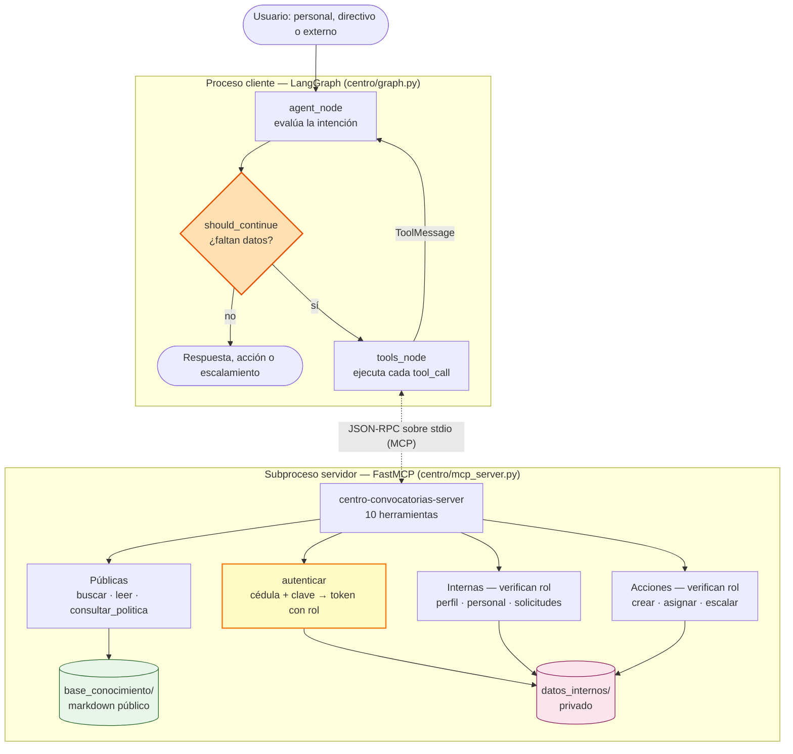
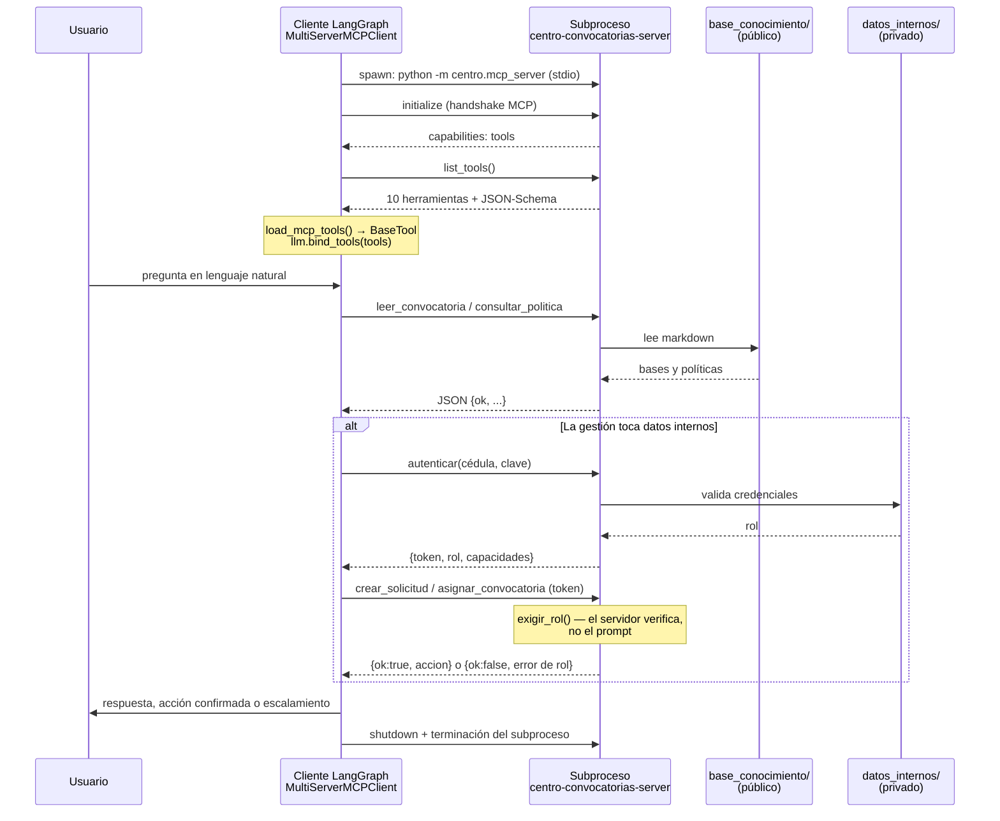

# Reflexión — Semana 2

**Proyecto:** Asistente de Evaluación de Convocatorias y Conformación de Equipos
**Cliente:** Centro de Proyectos y Consultoría — Universidad de los Alpes
**Repositorio:** [mesabusta/asistente-convocatorias](https://github.com/mesabusta/asistente-convocatorias)
**Integrantes:** [mesabusta](https://github.com/mesabusta) · [ysusecheo93](https://github.com/ysusecheo93)

---

## 1. Reflexión y diagrama actualizado

### Diagrama actualizado (semana 2)



> ### ⬛ REEMPLAZAR 1 de 3 — Diagrama de la semana 1
> Pega aquí la imagen del diagrama original o el enlace a la herramienta de
> diagramación, para que se vea el contraste con el diagrama de arriba.

### 1.1 Cambios respecto al diagrama de la semana 1

**¿Qué hipótesis del diseño original resultó incorrecta o incompleta?**

La hipótesis que falló fue **tratar la evaluación como una sola decisión**. El
diseño original tenía un único punto de bifurcación —«¿el Centro puede aplicar o
no?»— y asumía que se llegaba a él con toda la información en la mano. Al
implementarlo aparecieron tres decisiones encadenadas, y el orden importa:

1. **¿Esto es público o interno?** Determina si hay que pedir credenciales.
2. **¿Qué puede hacer este rol?** El personal y un directivo hacen preguntas
   parecidas y necesitan respuestas distintas.
3. **¿Es viable la convocatoria?** Y esta solo tiene sentido después de las
   otras dos.

Dos supuestos más resultaron incompletos:

- **Creímos que la autorización se podía manejar con instrucciones al modelo.**
  Un system prompt que dice «el personal nunca asigna» es una sugerencia, no un
  control. Lo movimos dentro de las herramientas.
- **No contemplábamos un camino que no fuera sí o no.** El caso del sector
  extractivo no se resuelve con ninguno de los dos: exige escalar. Eso obligó a
  agregar una salida que el diagrama original no tenía.

**¿Qué nodos o conexiones agregaron al incorporar tool calling y MCP?**

| Elemento nuevo | Rol |
|---|---|
| `tools_node` | Nodo ejecutor: recorre `last.tool_calls`, despacha contra `tools_map` y devuelve un `ToolMessage` por llamada. |
| Arista `tools_node → agent_node` | Cierra el ciclo ReAct: el resultado vuelve al LLM como contexto en lugar de terminar el grafo. |
| Arista condicional `should_continue` | Bifurcación entre `tools` y `END` según exista o no `tool_calls` en el último mensaje. |
| Frontera de proceso MCP | El servidor no es una función importada: es un **subproceso separado** que habla JSON-RPC sobre stdio. |
| Handshake `list_tools()` | El cliente descubre las diez herramientas en tiempo de ejecución en vez de tenerlas cableadas. |
| **Frontera de autenticación** | `autenticar` convierte credenciales en un token con rol. Las herramientas internas lo exigen y lo verifican **ellas mismas**. |
| **Salida de escalamiento** | `escalar_a_humanos` es un tercer desenlace, distinto de responder y de ejecutar una acción. |

**¿El punto de decisión agéntica sigue siendo el mismo?**

**Cambió de lugar, de naturaleza y de número.** En la semana 1 la decisión era
*«¿qué respondo?»*: un único punto terminal. Ahora el punto de decisión es
`should_continue`, y es **recurrente**: se evalúa después de cada turno del LLM,
así que el agente encadena tantas herramientas como necesite antes de concluir.

El cambio de fondo es que la decisión pasó de *generativa* a *de control de
flujo*: el agente ya no decide el contenido de la respuesta, decide **si tiene
evidencia suficiente para actuar**. La Situación A lo muestra — tras leer la
convocatoria y la política, `should_continue` cierra el grafo sin crear nada,
porque lo que encontró fue una brecha.

Y apareció una decisión que el diseño original no tenía: **cuándo no decidir**.
La Situación C termina invocando una herramienta cuyo propósito es documentar
que el caso supera al sistema.

---

## 2. Diseño de herramientas

### 2.1 Tabla de tools diseñadas

| Nombre | Descripción | Parámetros | Tipo de retorno |
|---|---|---|---|
| `buscar_convocatorias` | Lista las convocatorias abiertas filtrando por área, tipo o texto libre. Pública. | `area: str?`, `tipo: str?`, `texto: str?` | JSON `{ok, fuente, n_resultados, convocatorias[]}` o `{ok:false, error, areas_disponibles}` |
| `leer_convocatoria` | Lee las bases completas y extrae montos, topes, plazos y señales de riesgo. Pública. | `convocatoria_id: str` | JSON `{ok, id, entidad, tipo_entidad, overhead_maximo_pct, overhead_minimo_institucional_pct, señales_de_riesgo[], texto}` |
| `consultar_politica` | Devuelve la política de participación relevante para un tema. Pública. | `tema: str` | JSON `{ok, id, titulo, texto}` |
| `autenticar` | Valida cédula y clave de 4 dígitos y abre sesión. | `cedula: str`, `clave: str` | JSON `{ok, token, nombre, rol, capacidades[]}` |
| `consultar_perfil` | Perfil del usuario autenticado: experticia, nivel, dedicación, historial. Solo el propio. | `token: str` | JSON `{ok, fuente:"interna", perfil}` |
| `listar_personal` | Todo el personal del Centro, opcionalmente filtrado por área. **Solo directivo.** | `token: str`, `area: str?` | JSON `{ok, n_personas, personal[]}` o `{ok:false, brecha:"experticia"}` |
| `listar_solicitudes` | Solicitudes creadas por el personal. **Solo directivo.** | `token: str`, `convocatoria_id: str?` | JSON `{ok, n_solicitudes, solicitudes[]}` |
| `crear_solicitud` | Registra una postulación a nombre del usuario. **Solo personal.** | `token: str`, `convocatoria_id: str`, `rol_propuesto: str`, `justificacion: str` | JSON `{ok, accion:"solicitud_creada", solicitud}` o `{ok:false, brecha}` |
| `asignar_convocatoria` | Asigna la convocatoria a un equipo concreto. **Solo directivo.** | `token: str`, `convocatoria_id: str`, `cedulas: list[str]`, `justificacion: str` | JSON `{ok, accion:"convocatoria_asignada", asignacion}` |
| `escalar_a_humanos` | Entrega el caso al equipo humano con un resumen estructurado. | `motivo: str`, `convocatoria_id: str?`, `analisis_realizado: list?`, `brechas: list?`, `preguntas_pendientes: list?` | JSON `{ok, accion:"escalado", destinatario, brechas[], preguntas_pendientes[]}` |

Las diez se definen una sola vez en `centro/tools.py`; `centro/mcp_server.py`
las envuelve con `@mcp.tool()` sin duplicar lógica. Los parámetros usan
`Annotated[tipo, Field(description=...)]`, que es lo que FastMCP convierte en el
JSON-Schema que ve el modelo: **la descripción del parámetro es el prompt que
guía la elección de argumentos**.

Todas comparten el contrato de error `{"ok": false, "error": "..."}`. Un
`ok=false` no es una excepción: es información con la que el agente puede
reintentar por otro camino o reportar una brecha concreta.

### 2.2 Justificación

- **`buscar_convocatorias`** — El usuario no conoce los códigos internos; pide
  «la del BID de educación». Sin esta herramienta habría que exigirle el
  identificador exacto.
- **`leer_convocatoria`** — Es la fuente de todo requisito. Además calcula el
  mínimo institucional aplicable según el tipo de entidad, que es el dato que
  convierte un tope en una brecha.
- **`consultar_politica`** — Las restricciones que dejan a la universidad por
  fuera están en las políticas, no en las bases. Detectarlas tarde es
  exactamente el error caro que describe el caso.
- **`autenticar`** — Es la frontera entre lo público y lo interno. Devuelve el
  rol junto con el token para que la capacidad viaje con la identidad.
- **`consultar_perfil`** — Permite contrastar los requisitos contra la persona
  real. No recibe cédula como parámetro: así no existe la posibilidad de
  consultar el perfil ajeno.
- **`listar_personal`** — El directivo necesita ver el conjunto para conformar
  un equipo; el personal no. La herramienta encarna esa asimetría.
- **`listar_solicitudes`** — Es el insumo de la decisión de asignación: quién se
  postuló, en qué rol y con qué argumento.
- **`crear_solicitud`** — Materializa que el personal *propone*. Verifica
  brechas antes de registrar, de modo que no queden solicitudes sobre
  convocatorias inviables.
- **`asignar_convocatoria`** — La única forma de comprometer personal. Exige
  justificación: una asignación sin razones contra los criterios de evaluación
  se rechaza.
- **`escalar_a_humanos`** — Convierte «no sé» en un entregable. Sin ella el
  agente solo podría rendirse en prosa y el Comité tendría que rehacer el
  análisis.

### 2.3 Decisiones de diseño

**¿Cómo decidieron qué encapsular en una tool versus dejar como lógica interna?**

Aplicamos cuatro criterios:

1. **Todo lo que cruza la frontera de confianza es una tool.** Leer un
   documento público, autenticar, tocar datos internos. La frontera es
   justamente lo que hay que poder auditar.
2. **Toda acción con efecto es una tool.** Crear una solicitud o asignar un
   equipo cambia el estado del mundo. El agente nunca puede *afirmar* que ocurrió
   sin la confirmación de la herramienta que lo ejecutó.
3. **La autorización va en la tool, nunca en el prompt.** Este fue el criterio
   más consecuente. `centro/internos.exigir_rol` es el punto único donde se
   decide si una operación interna procede. Un system prompt que dice «el
   personal nunca asigna» es una sugerencia que se puede desobedecer; una
   función que devuelve `ok=false` no. Hay un test — con el agente completo
   pasando por MCP — que hace que el modelo intente autoasignarse y verifica que
   la herramienta lo rechaza.
4. **La interpretación se queda en el agente.** Decidir qué consultar, en qué
   orden, y traducir el JSON a lenguaje natural es trabajo del LLM. Ninguna tool
   devuelve prosa: devuelven JSON y el agente redacta.

Quedaron como lógica interna, no expuesta: la carga y el parseo de los
documentos (`kb.py`), el manejo de sesiones y el filtrado de campos sensibles
(`internos.py`). La clave nunca sale de `internos`: `perfil_publico()` la
descarta antes de que cualquier herramienta pueda verla.

La regla práctica quedó así: **la tool aporta hechos y hace cumplir permisos; el
agente aporta criterio.**

**¿Descartaron alguna tool durante el diseño?**

Sí, tres:

- **`evaluar_viabilidad(convocatoria_id)`** — Una única herramienta que
  devolviera «aplica / no aplica». La descartamos porque movía el juicio al
  servidor: el agente habría dejado de razonar y se habría vuelto un pasamanos.
  El caso pide razonamiento en etapas, y eso exige que las piezas lleguen
  separadas.
- **`recomendar_equipo(convocatoria_id)`** — Habría producido el equipo
  óptimo por cuenta propia. Es exactamente la decisión que el caso reserva a los
  directivos. Dejamos que el agente proponga con `listar_personal` y
  `listar_solicitudes`, pero que comprometer personal siga exigiendo
  `asignar_convocatoria` con justificación.
- **`consultar_personal(cedula)`** — Ver el perfil de otra persona. La
  eliminamos por diseño: `consultar_perfil` no recibe cédula, así que la
  capacidad de espiar el perfil ajeno no existe en la superficie de la API.
  Un directivo que necesite ver a otros usa `listar_personal`, que sí verifica
  el rol.

---

## 3. Evidencia del agente con tool calling

Reproducible con `python -m centro.evidencia_flujo`. El LLM se sustituye por
`ScriptedLLM` para que la evidencia sea determinista y ejecutable en CI sin
Ollama; **el servidor MCP, la ejecución de las herramientas, la autenticación y
el control de rol son reales**.

### Situación A — brecha de política: el agente no crea la solicitud

```text
[HANDSHAKE MCP] 10 herramientas descubiertas:
  buscar_convocatorias, leer_convocatoria, consultar_politica, autenticar,
  consultar_perfil, listar_personal, listar_solicitudes, crear_solicitud,
  asignar_convocatoria, escalar_a_humanos

[ENTRADA DEL USUARIO]
¿Puedo postularme a la convocatoria del BID de innovación en educación superior?

[DECISIÓN DEL AGENTE] -> invocar herramienta
  herramienta: leer_convocatoria
  argumentos : {"convocatoria_id": "BID-2026-EDU-014"}

[RESULTADO DEL SERVIDOR MCP]
  {
    "ok": true,
    "fuente": "publica",
    "entidad": "Banco Interamericano de Desarrollo (BID)",
    "tipo_entidad": "organismo_internacional",
    "overhead_maximo_pct": 12,
    "overhead_minimo_institucional_pct": 15,
    "señales_de_riesgo": [],
    "texto": "<1899 caracteres de texto markdown>"
  }

[DECISIÓN DEL AGENTE] -> invocar herramienta
  herramienta: consultar_politica
  argumentos : {"tema": "overhead"}

[RESULTADO DEL SERVIDOR MCP]
  {
    "ok": true,
    "fuente": "publica",
    "id": "POL-FIN-001",
    "titulo": "Política de overhead y contrapartida institucional"
  }

[RESPUESTA FINAL DEL AGENTE]
No deberías postularte a la BID-2026-EDU-014 en las condiciones actuales.
Encontré dos brechas, ambas leídas de fuentes públicas:

1. CONSORCIO. Las bases exigen un consorcio con al menos una universidad de
otro país miembro del BID. Las propuestas de una sola institución no son
habilitadas, y el Centro no tiene ese socio constituido.

2. OVERHEAD. La convocatoria reconoce un máximo del 12% de costos indirectos.
La política POL-FIN-001 fija un mínimo institucional del 15% para organismos
internacionales. La brecha es de 3 puntos y solo la puede levantar una exención
de la Vicerrectoría de Investigación.

Por eso no creé ninguna solicitud: mientras la brecha exista, postularse sería
invertir tiempo en una propuesta inhabilitada.
```

Nótese que **no se invocó `autenticar`**: la pregunta se resolvió con las dos
fuentes públicas. Y que el `overhead_minimo_institucional_pct: 15` frente al
`overhead_maximo_pct: 12` es lo que convierte un dato en una brecha.

### Situación C — riesgo reputacional: el agente escala en vez de decidir

```text
[DECISIÓN DEL AGENTE] -> leer_convocatoria {"convocatoria_id": "PETROANDINA-2026-RSE-002"}

[RESULTADO DEL SERVIDOR MCP]
  {
    "ok": true,
    "sector_entidad": "extractivo",
    "monto_cop": null,
    "monto_declarado": "a convenir",
    "señales_de_riesgo": [
      "La entidad pertenece a un sector con restricción reputacional: extractivo.",
      "El presupuesto se declara 'a convenir': no hay valor de referencia público."
    ]
  }

[DECISIÓN DEL AGENTE] -> consultar_politica {"tema": "riesgo reputacional"}
  → POL-RIE-002 · Política de riesgo reputacional y sectores con restricción

[DECISIÓN DEL AGENTE] -> escalar_a_humanos
  motivo    : "Riesgo reputacional: la entidad pertenece al sector extractivo y el
               estudio implica datos sensibles de comunidades."
  brechas   : ["Sector extractivo: restricción del numeral 1 de POL-RIE-002.",
               "Datos sensibles de comunidades: señal 3 de la misma política.",
               "Sin monto de referencia: no se puede determinar el nivel de autorización."]
  preguntas : ["¿El Comité emite concepto favorable pese a los procesos ambientales?",
               "¿Existe marco de tratamiento de datos comunitarios aprobado?",
               "¿Qué valor estimado se usa con presupuesto a convenir?"]

[RESULTADO DEL SERVIDOR MCP]
  {
    "ok": true,
    "accion": "escalado",
    "destinatario": "Comité de Ética y Reputación",
    "nota": "No se creó solicitud ni se asignó equipo. La decisión queda en manos humanas."
  }
```

> ### ⬛ REEMPLAZAR 2 de 3 — Screenshot del flujo extremo a extremo
> Captura de la terminal ejecutando `python -m centro.evidencia_flujo`.
> Debe verse el handshake MCP con las diez herramientas, las decisiones del
> agente y el JSON de cada resultado. Las cuatro situaciones están en la salida.

### ¿Qué señal del input llevó al agente a invocar esa tool y no continuar sin ella?

En la Situación A la señal es **la mención de una convocatoria concreta unida a
una pregunta de elegibilidad**. «¿Puedo postularme a la del BID de innovación en
educación superior?» no se puede responder sin saber qué exige esa convocatoria,
y ese texto solo existe en la base de conocimiento. La correspondencia entre lo
que pide el usuario y lo que declara el JSON-Schema de `leer_convocatoria` es lo
que dispara la llamada.

El contraste lo aclara: *«¿qué es el overhead en un proyecto de investigación?»*
tiene vocabulario del mismo dominio pero **no interroga a ninguna convocatoria ni
política concreta**, así que el agente responde directamente. La señal no es el
tema: es la necesidad de un dato que solo existe en una fuente.

Hay además dos señales de segundo orden, y son las que hacen que el ciclo sea
agéntico y no una secuencia fija:

- **El resultado de una herramienta dispara la siguiente.** Ver
  `overhead_maximo_pct: 12` no significa nada por sí solo; es lo que motiva
  consultar la política para saber cuál es el mínimo institucional.
- **Un `ok=false` reencamina el flujo.** Cuando `crear_solicitud` rechaza por
  brecha de overhead, el agente no reintenta con otros argumentos: reporta la
  brecha. Y cuando `leer_convocatoria` devuelve `señales_de_riesgo`, el agente
  abandona la vía de la postulación y toma la del escalamiento.

---

## 4. Arquitectura MCP

### Implementación concreta



| Componente | Archivo | Detalle |
|---|---|---|
| Servidor | `centro/mcp_server.py` | `FastMCP(name="centro-convocatorias-server")`, transporte **stdio** |
| Herramientas | `centro/tools.py` | 3 públicas, 1 de autenticación, 3 de lectura interna, 3 de acción |
| Fuente pública | `base_conocimiento/` | 6 convocatorias y 4 políticas en markdown con frontmatter |
| Fuente privada | `datos_internos/` | Personal, credenciales y solicitudes |
| Cliente | `centro/graph.py` | `MultiServerMCPClient` + `load_mcp_tools()` dentro de `async with client.session("centro")` |
| Descubrimiento | — | Dinámico vía `list_tools()`: agregar una herramienta no requiere tocar el cliente |
| Control de acceso | `centro/internos.py` | `exigir_rol()` — punto único de decisión, del lado del servidor |

**Verificación automatizada:** `test_mcp_expone_las_diez_herramientas` abre una
sesión MCP real y verifica el handshake, y
`test_flujo_personal_que_intenta_asignar_es_rechazado_por_la_tool` recorre el
agente completo intentando una autoasignación y comprueba que el servidor la
rechaza. Ambos corren en cada pipeline.

### ¿Qué cambia si el servidor MCP lo opera un equipo externo?

Lo que **no** cambia es el código del agente: esa es la promesa del protocolo.
`graph.py` seguiría llamando `load_mcp_tools(session)` sin enterarse. Lo que
cambia está en cinco frentes, y en este caso uno es más grave que en otros:

1. **Transporte y confianza.** stdio deja de servir: se pasa a HTTP/SSE, y con
   eso aparecen autenticación de servicio, TLS, latencia y rate limiting. La
   configuración deja de ser `command`/`args` y pasa a ser una URL con
   credenciales que hay que gestionar como secretos.
2. **La autenticación de usuario se vuelve un problema de identidad
   federada.** Hoy la cédula y la clave viajan por un pipe a un subproceso de
   la propia máquina. Contra un servidor externo estaríamos enviando
   credenciales del personal fuera del perímetro de la universidad. Habría que
   sustituirlo por un esquema donde el Centro autentique localmente y el
   servidor externo solo reciba un token firmado, sin ver la clave.
3. **El contrato se vuelve un acuerdo entre equipos.** Hoy, si cambia el nombre
   de un parámetro, cambian las dos puntas en el mismo commit. Con un proveedor
   externo un cambio de schema es un *breaking change* que hay que versionar y
   anunciar, y se necesitan contract tests contra staging.
4. **La superficie de fallo se multiplica.** Un subproceso local falla de forma
   binaria. Un servidor remoto puede estar caído, lento, devolver datos
   obsoletos o cortar a mitad de respuesta. `tools_node` ya captura excepciones,
   pero habría que añadir timeouts, reintentos con backoff y un circuit breaker.
5. **Gobernanza del dato.** Los datos del personal —experticia, historial,
   resultados de proyectos— son información laboral. Que salgan del perímetro
   institucional deja de ser una decisión técnica y pasa a requerir concepto
   jurídico y acuerdo de tratamiento de datos.

En resumen, el servidor externo pasa de ser una **dependencia de código** a ser
una **dependencia de servicio** — y, en un caso con datos de personas y
credenciales, también una **dependencia de cumplimiento**.

---

## 5. GitHub Actions

Pipeline en `.github/workflows/entrega.yml`: se dispara en cada `push` a `main`
y en cada `pull_request`, instala `requirements.txt` sobre Python 3.13 y ejecuta
`pytest -m semana2 -q`.

**Flujo de trabajo del repositorio.** Historial limpio: un commit base con la
estructura del proyecto y el trabajo de la semana aislado en la rama
`semana2-tool-calling-mcp`, que se integra por pull request. El pipeline actúa
como *quality gate*: los 35 tests corren antes del merge, no después.

Resultado local de la misma suite que corre el pipeline:

```text
============================= test session starts ==============================
platform linux -- Python 3.11.15, pytest-8.3.5, pluggy-1.6.0
rootdir: /asistente-convocatorias
configfile: pytest.ini
testpaths: tests
plugins: langsmith-0.3.45, asyncio-0.25.3, anyio-4.14.2
asyncio: mode=Mode.AUTO
collected 35 items

tests/test_semana2.py::test_buscar_convocatorias_sin_autenticar PASSED   [  2%]
tests/test_semana2.py::test_leer_convocatoria_expone_tope_y_minimo_institucional PASSED
tests/test_semana2.py::test_leer_convocatoria_marca_senales_de_riesgo PASSED
tests/test_semana2.py::test_consultar_politica_encuentra_la_correcta[overhead-POL-FIN-001] PASSED
tests/test_semana2.py::test_personal_no_puede_listar_personal PASSED     [ 40%]
tests/test_semana2.py::test_personal_no_puede_asignar PASSED             [ 45%]
tests/test_semana2.py::test_perfil_solo_devuelve_el_propio_y_nunca_la_clave PASSED
tests/test_semana2.py::test_brecha_de_overhead_bloquea_la_solicitud PASSED
tests/test_semana2.py::test_riesgo_reputacional_bloquea_la_solicitud PASSED
tests/test_semana2.py::test_asignar_actualiza_el_estado_de_las_solicitudes PASSED
tests/test_semana2.py::test_mcp_expone_las_diez_herramientas PASSED      [ 88%]
tests/test_semana2.py::test_flujo_consulta_publica_no_pide_identidad PASSED
tests/test_semana2.py::test_flujo_personal_que_intenta_asignar_es_rechazado_por_la_tool PASSED
tests/test_semana2.py::test_flujo_riesgo_reputacional_escala PASSED      [100%]

============================== 35 passed in 2.75s ===============================
```

*(Salida recortada: se muestran 14 de los 35 tests.)*

La suite cubre los criterios de éxito del caso: separación entre lo público y lo
interno, control de rol en las cuatro operaciones restringidas, reporte de
brechas específicas, atribución correcta de la solicitud, justificación
obligatoria en la asignación, y resumen estructurado en el escalamiento.

> ### ⬛ REEMPLAZAR 3 de 3 — Screenshot del pipeline en verde
> Captura de la pestaña **Actions** del repositorio con el check verde y los
> 35 tests pasando.
